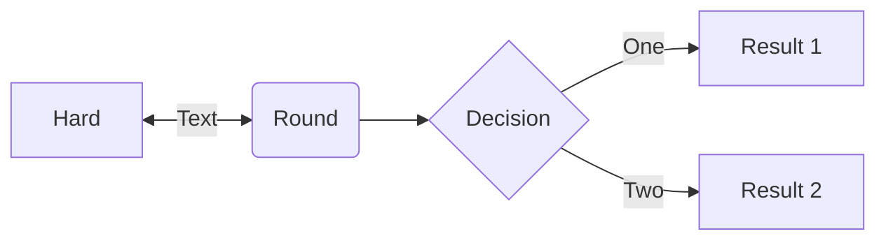

# mrs_llcp_ros
This package is the ROS interface for the low-level communication protocol (LLCP) which is used by the MRS group to communicate with lower level devices.
The management of the serial port on Linux can be a hassle, so this packages takes care of that for you, you just specify the serial port and baud rate.

